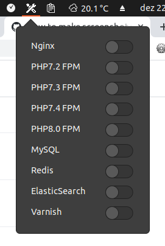

# Web Dev Panel

A [Gnome Shell Extension](https://extensions.gnome.org/) to control Web and Database Server in a GUI Panel.  This project was based upon code from [Gnome Extension: Web Dev Panel](https://github.com/mdrmike/web-dev-panel).



## Configuration
Edit file `~/.local/share/gnome-shell/extensions/services-panel@raul.sakai/_config.js` and modify the constant `SERVICES_ARRAY`

### How to use SERVICES_ARRAY constant
```
const SERVICES_ARRAY = [
    ...
    {
        "label": "PHP8.0 FPM",
        "service": "php8.0-fpm"
    }
    ...
];
```

## Future Development
- Auto discover services
- Configuration from UI and not file
- Enable or disable services auto startup